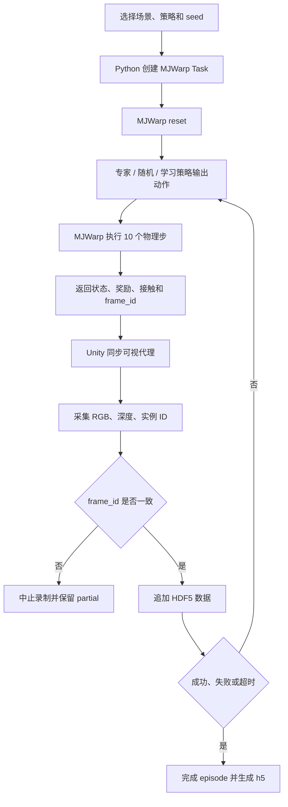
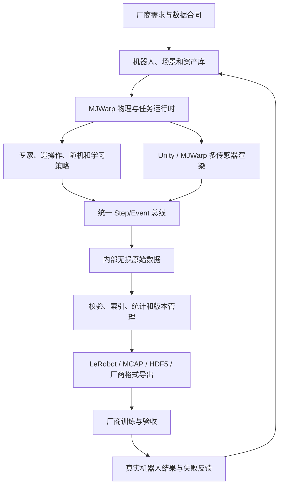

# 具身智能仿真训练系统建设指南

> 面向当前 `MJWarp × Unity` 项目的产品目标、数据产品设计和实施路线图
> 适合读者：刚开始接触具身智能、机器人、仿真数据和模型训练的产品负责人或工程负责人

## 1. 先说结论

你的最终目标不应表述为“做一个机器人仿真 Demo”，而应该表述为：

> 建设一套可配置、可批量运行、可验证、可追溯的机器人仿真数据生产系统，根据机器人厂商给出的机器人、任务和数据规范，持续生成可直接用于训练、评估或算法开发的数据产品。

这个目标包含三个彼此不同的交付物：

1. **仿真系统**：在虚拟环境里正确复现机器人、场景、传感器和任务。
2. **数据生产系统**：批量生成状态、动作、图像、接触、奖励、成功/失败等严格同步的数据。
3. **数据产品**：将数据按厂商可读取的格式、字段、坐标系、质量标准和许可证进行交付，并附带验证工具和说明文档。

当前项目已经证明了第 1、2 项的核心链路，也实现了一个基础训练闭环，但距离“可交付给机器人厂商的数据产品”还有明显差距。接下来的重点不是继续增加很多演示场景，而是先选定：

- 一个目标机器人厂商；
- 一个真实机器人型号；
- 一个厂商愿意验收的具体任务；
- 一份双方确认的数据合同；
- 一批可以被厂商工具成功读取的样例数据。

没有这五项，继续大量生成数据的风险很高，因为数据可能在动作定义、坐标系、控制频率、相机标定或文件格式上无法被厂商使用。

---

## 2. 零基础概念说明

### 2.1 什么是具身智能

具身智能可以简单理解为：

> 智能体不只“看和说”，还要通过身体感知环境、做出动作，并根据动作产生的结果继续决策。

对于机器人，一个最基本的循环是：

```text
传感器观察环境 → 模型或策略决定动作 → 机器人执行动作 → 环境发生变化 → 再次观察
```

例如机械臂抓取箱子：相机看到箱子，策略输出机械臂动作，机械臂移动，下一帧重新观察箱子和夹爪的位置，直到抓取成功或失败。

### 2.2 仿真系统是什么

仿真系统在计算机里模拟：

- 机器人的结构、关节和执行器；
- 重力、摩擦、碰撞和接触；
- 相机、深度、力传感器等传感器；
- 工作台、货架、箱子等环境对象；
- 任务目标和成功、失败条件。

当前项目中：
- **MJWarp/MuJoCo** 负责物理；
- **Unity URP** 负责可视化和 RGB、深度、实例 ID 采集；
- **Python** 负责服务、数据写入、训练和模型推理；
- **HDF5** 是当前原始回合数据的存储格式。

MJWarp 官方定位是面向 NVIDIA GPU 的高吞吐并行仿真，更适合需要大量样本的训练场景，而不是追求单个环境最低延迟的实时控制。参见 [MuJoCo Warp 官方文档](https://mujoco.readthedocs.io/en/3.6.0/mjwarp/)。

### 2.3 什么是 Episode 和 Step

- **Episode（回合）**：机器人从任务开始到成功、失败或超时的一整段过程。
- **Step（步骤/控制帧）**：回合中的一次“观察—动作—结果”。

一个标准回合通常包含：

```text
初始观察 o0
  └─ 执行动作 a0，得到奖励 r0 和下一观察 o1
       └─ 执行动作 a1，得到奖励 r1 和下一观察 o2
            └─ ...
```

### 2.4 Observation、Action、Reward、Done

| 名称 | 中文理解 | 示例 |
|---|---|---|
| Observation | 机器人当前能够观察到的信息 | 关节角、关节速度、RGB、深度、目标位置 |
| Action | 要机器人执行的控制命令 | 目标关节位置、关节速度、力矩、末端位姿增量 |
| Reward | 对当前结果的数值评价 | 靠近目标得正分，碰撞或大动作扣分 |
| Done/Terminated | 回合是否结束 | 成功、碰撞失败、越界或超时 |
| Policy | 根据 Observation 产生 Action 的规则或模型 | 专家规则、随机策略、神经网络 |

### 2.5 模仿学习、强化学习和离线强化学习

- **模仿学习/行为克隆**：用专家演示训练模型，让模型学习“看到这种状态时，专家会做什么动作”。当前项目已经实现状态行为克隆。
- **强化学习**：策略在仿真中反复尝试，根据奖励自动学习。当前项目尚未实现在线强化学习。
- **离线强化学习**：只使用已有数据学习，不继续与环境交互。它对数据的奖励、终止和覆盖范围要求更高。

### 2.6 Sim-to-Real 是什么

Sim-to-Real 是让在仿真中产生的数据或训练的模型能够用于真实机器人。

最大困难是“仿真和现实不完全一样”，包括：

- 摩擦、质量、阻尼不准；
- 相机颜色、噪声、曝光不同；
- 机器人控制延迟和回差不同；
- 物体尺寸、材质和摆放分布不同；
- 仿真动作接口与真实控制器不一致。

常用方法是 **Domain Randomization（域随机化）**：在合理范围内随机变化光照、材质、物体位置、相机位置和物理参数，使数据覆盖更广。NVIDIA 的合成数据工作流也把光照、纹理、对象姿态和相机变化作为核心随机化维度，参见 [Isaac Sim Synthetic Data Generation](https://docs.isaacsim.omniverse.nvidia.com/latest/synthetic_data_generation/index.html)。这并不意味着项目必须迁移到 Isaac Sim，而是说明需要补齐同类的数据多样性和记录能力。

---

## 3. 你的目标应该怎样拆解

建议将目标拆成四层，每层都要有独立验收标准。

### 3.1 第一层：机器人和任务定义

你需要明确：

- 为哪一种机器人服务；
- 机器人有多少关节、什么夹爪、什么控制器；
- 要完成什么任务；
- 什么算成功、失败和危险；
- 真实机器人能提供哪些传感器；
- 厂商希望模型输出什么动作。

这一层不明确，后续仿真和数据都没有稳定目标。

### 3.2 第二层：高可信仿真

需要做到：

- 机器人几何、关节、限制和执行器与真实设备一致；
- 任务对象和环境尺寸合理；
- 物理参数可以配置和随机化；
- 传感器模型与真实设备对应；
- 相同 seed 可以复现；
- 每次任务的配置都被记录。

### 3.3 第三层：规模化数据生产

需要做到：

- 自动批量运行，而不是人工点击；
- 专家、随机、噪声专家、失败恢复等多种数据来源可配置；
- 状态、动作和传感器严格同步；
- 任务成功、失败原因和安全事件有明确标签；
- 数据边生成边校验；
- 中断后能够恢复，不产生伪完整数据；
- 可以追踪数据由哪个代码版本、场景版本和参数生成。

### 3.4 第四层：数据产品和厂商交付

需要做到：

- 厂商拿到数据后可以直接读取；
- 字段名称、单位、坐标系和动作语义无歧义；
- 提供 schema、示例代码、校验工具、数据卡和质量报告；
- 支持厂商要求的 LeRobot、ROS 2 MCAP、HDF5、Parquet 或自定义格式；
- 数据有版本号、校验和、许可证和变更记录；
- 厂商能够用样例数据跑通自己的训练或评估流程。

真正能够销售或交付的不是一堆文件，而是：

> 数据文件 + 数据合同 + 质量证明 + 读取工具 + 版本与来源证明。

---

## 4. 当前项目已经具备什么

### 4.1 已经完成的核心能力

| 能力 | 当前状态 | 代码入口 |
|---|---|---|
| 四类任务场景 | 已实现物流推运、精密插入、质检到位和仓储导航 | [`scenarios.py`](../External/MJWarpDemo/mjwarp_demo/scenarios.py) |
| MJWarp 物理任务 | 已实现 reset、专家/随机策略、奖励、成功和终止 | [`task.py`](../External/MJWarpDemo/mjwarp_demo/task.py) |
| Unity 运行编排 | 已实现后端启动、场景、策略、回合和批量操作 | [`MjWarpDemoController.cs`](../Assets/MJWarpDemo/Runtime/MjWarpDemoController.cs) |
| Unity 可视化 | 根据后端 ModelSpec 创建无碰撞代理并同步状态 | [`MjWarpVisualizer.cs`](../Assets/MJWarpDemo/Runtime/MjWarpVisualizer.cs) |
| 多模态采集 | 已实现 320×240 RGB、线性深度和实例 ID | [`MultiModalCapture.cs`](../Assets/MJWarpDemo/Runtime/MultiModalCapture.cs) |
| 同帧门禁 | 状态没有收到相同 frame ID 图像前，后端拒绝下一步 | [`server.py`](../External/MJWarpDemo/mjwarp_demo/server.py) |
| HDF5 录制 | 已实现 `.partial`、逐帧 flush、正常结束原子改名 | [`recorder.py`](../External/MJWarpDemo/mjwarp_demo/recorder.py) |
| 数据校验 | 检查字段、长度、形状、有限值和接触容量 | [`validate_dataset.py`](../External/MJWarpDemo/mjwarp_demo/validate_dataset.py) |
| 数据清单 | 按 seed 划分 train/validation/test 并生成 SHA256 | [`training/data.py`](../External/MJWarpDemo/mjwarp_demo/training/data.py) |
| 行为克隆 | 已实现训练、归一化、早停、离线评估和产物封装 | [`training/train_bc.py`](../External/MJWarpDemo/mjwarp_demo/training/train_bc.py) |
| 在线模型推理 | 已实现场景/维度校验、延迟保护和动作归零 | [`learned_policy.py`](../External/MJWarpDemo/mjwarp_demo/learned_policy.py) |
| 其他数据应用 | 已实现风险、实例分割和动力学的离线训练示例 | [`training/models.py`](../External/MJWarpDemo/mjwarp_demo/training/models.py) |
| 自动化验证 | 已有 Python、Unity EditorMode 和 PlayMode 测试代码 | [`Tests`](../Assets/MJWarpDemo/Tests/) |

### 4.2 当前数据的生成链路



这一链路最值得保留的设计是：**物理状态和 Unity 图像必须使用同一个 frame ID 才允许落盘**。这能避免训练时图像与动作错帧。

### 4.3 当前项目处于什么阶段

建议把当前成熟度判断为：

> 面向技术验证的 PoC，已经具备端到端闭环，但还不是面向机器人厂商的数据生产平台。

| 维度 | 当前成熟度 | 主要原因 |
|---|---|---|
| 物理与任务闭环 | PoC 可用 | 四个 primitive 任务能够运行，但不是真实厂商机器人 |
| 时间同步 | 较好 | 已有 frame ID 和 pending state 门禁 |
| 数据 schema | PoC 可用 | schema 1.1 清晰，但仍是项目私有格式 |
| 训练验证 | 基础可用 | 行为克隆闭环已实现，训练依赖尚未安装到当前默认环境 |
| 批量规模 | 部分具备 | MJWarp 能做并行物理，但 Unity 多模态采集仍是单 world |
| 数据兼容性 | 未完成 | 没有 LeRobot、ROS 2、robomimic 或厂商格式导出器 |
| 真实机器人映射 | 未完成 | 当前统一为 2 维归一化动作，缺少真实机器人控制接口 |
| Sim-to-Real | 未开始 | 没有真实数据对照、标定和迁移验收 |
| 商业交付 | 未完成 | 缺少数据合同、数据卡、许可证和厂商验收工具 |

---

## 5. 当前项目与最终目标之间的关键差距

### 5.1 还没有目标机器人

当前四个任务都使用简化 primitive 和两个执行器。它们适合验证管线，却不能代表六轴机械臂、双臂机器人、AMR 或人形机器人。

需要从厂商获得：

- URDF、MJCF、USD 或其他机器人模型；
- 关节名称、顺序、零位和限制；
- 执行器和控制器类型；
- 末端执行器或夹爪定义；
- 自碰撞和禁碰撞规则；
- 标称质量、惯量、摩擦和阻尼；
- 真实控制频率与通信延迟。

### 5.2 Action 定义尚不能直接对接真实机器人

当前 action 是两个 `[-1, 1]` 归一化值，内部映射为目标速度并转成力矩。机器人厂商可能要求：

- 关节位置；
- 关节速度；
- 关节力矩；
- 末端笛卡尔位姿；
- 末端位姿增量；
- 夹爪开合；
- 移动底盘线速度和角速度。

这不是简单改字段名。动作的含义、单位、坐标系、频率和延迟都必须与真实控制器一致。

### 5.3 缺少传感器标定信息

当前有 RGB、深度和实例 ID，但厂商通常还需要：

- 相机内参：焦距、主点、畸变模型；
- 相机外参：相机相对于机器人 base、末端或世界坐标系的位姿；
- 曝光、帧率、深度量程和无效值定义；
- 传感器时间戳及同步误差；
- 可选的力/力矩、触觉、激光雷达、IMU 等数据。

### 5.4 域随机化维度不足

当前主要随机化：

- 初始位置和目标；
- 部分光照；
- 少量相机位置；
- 物体颜色。

后续至少要支持并记录：

- 质量、惯量、摩擦、阻尼；
- 执行器增益、噪声、延迟、死区；
- 相机噪声、曝光、白平衡、畸变；
- 纹理、材质、背景和干扰物；
- 物体尺寸、形状、磨损和摆放；
- 环境布局和遮挡；
- 参数采样分布与实际抽样值。

只随机化但不记录随机参数，数据将难以复现，也无法分析某类失败是由什么变化导致的。

### 5.5 数据格式尚未产品化

当前每个 episode 一个 HDF5 文件，适合 PoC 和调试。规模达到几十万或几百万回合时，会出现：

- 文件数量过多；
- 图像占用巨大；
- 初始化和索引变慢；
- 跨场景统计困难；
- 厂商需要额外转换。

LeRobotDataset v3 将低维时序数据放在 Parquet，将多相机视觉数据放在视频分片，并使用关系元数据恢复 episode 边界，适合大规模数据集索引和流式读取。参见 [LeRobotDataset v3 官方文档](https://huggingface.co/docs/lerobot/lerobot-dataset-v3)。

### 5.6 缺少真实数据闭环

仿真数据是否有价值，最终要通过真实机器人验证。至少要有：

- 一小批真实机器人同任务数据；
- 相同 observation/action 定义；
- 仿真和真实特征分布对比；
- 仿真训练模型在真实机器人上的 zero-shot 或少量微调结果；
- 对失败原因的复盘和仿真参数修正。

---

## 6. 先向机器人厂商问清楚什么

建议第一次需求会议不要直接问“需要多少数据”，而是按下面的清单逐项确认。

### 6.1 机器人本体

- 机器人品牌、型号和硬件版本是什么？
- 有多少自由度？是否包含底盘、腰部、头部或夹爪？
- 是否能提供 URDF/MJCF/USD、mesh 和关节参数？
- 关节顺序和命名是什么？
- 控制接口支持位置、速度、力矩还是末端控制？
- 控制频率、动作延迟和安全限制是什么？

### 6.2 任务

- 希望解决的第一个具体任务是什么？
- 任务场景、对象和环境尺寸是什么？
- 成功标准如何自动判断？
- 有哪些失败类型和危险动作？
- 需要单任务数据还是多任务、语言条件数据？
- 需要成功演示、失败数据、恢复数据还是探索数据？

### 6.3 传感器

- 有哪些相机？分辨率、帧率和位置是什么？
- 是否有深度、点云、IMU、力/力矩或触觉？
- 能否提供相机标定文件和时间同步方式？
- 厂商训练时实际使用哪些传感器？

### 6.4 数据格式

- 厂商已有的数据加载代码能读取什么格式？
- 是否接受 HDF5、LeRobot、RLDS、ROS 2 MCAP 或 Parquet？
- 字段命名、shape、dtype 和单位要求是什么？
- observation 和 action 的时序关系是什么？
- 图像使用原始帧、PNG、JPEG、MP4 还是其他编码？
- 是否需要 `next_observation`？
- 是否需要自然语言任务描述？

### 6.5 规模和分布

- 需要多少 episode、多少小时或多少 step？
- 任务、对象、场景和失败类型的比例是什么？
- train/validation/test 怎样划分？
- 是否要求不同场景资产或不同机器人严格隔离？

### 6.6 验收和商务

- 厂商怎样判断数据“可用”？
- 是成功导入即验收，还是要求训练指标或真实机器人效果？
- 是否涉及保密、资产授权、数据归属和再分发限制？
- 交付频率、增量更新和问题修复 SLA 是什么？

第一次会议的理想产物不是会议纪要，而是：

```text
vendor_data_contract_v0.1.md
vendor_sample_reader/
sample_dataset_v0.1/
acceptance_checklist_v0.1.md
```

---

## 7. 建议的数据合同

数据合同是系统最重要的文档。代码和数据都必须遵守它。

### 7.1 Episode 级元数据

每个回合建议至少记录：

| 字段 | 含义 |
|---|---|
| dataset_id / dataset_version | 数据集唯一标识和版本 |
| episode_id | 全局唯一回合 ID |
| task_id / task_text | 任务 ID 和自然语言描述 |
| robot_id / embodiment | 机器人型号和本体版本 |
| scenario_id / scene_version | 场景与资产版本 |
| policy_type / policy_version | 专家、遥操作、随机、模型及版本 |
| seed | 随机种子 |
| success | 最终是否成功 |
| termination_reason | success、timeout、collision、out_of_bounds、manual_abort 等 |
| control_mode / control_hz | 动作模式和控制频率 |
| simulator_version | MuJoCo、MJWarp、Unity 和项目提交版本 |
| randomization_config | 随机化配置及本回合实际采样值 |
| calibration_version | 相机和传感器标定版本 |
| license / provenance | 资产来源、数据权属和许可证 |
| checksum | 文件和清单校验和 |

### 7.2 Step 级数据

建议明确保存：

```text
timestamp
observation
action
reward
next_observation
is_first
is_last
is_terminal
success
failure_reason
```

RLDS 把顺序决策数据定义为 Episode 和 Step，并强调 `observation/action/reward/is_first/is_last/is_terminal` 的明确语义。这个设计可作为数据合同参考，不过其原始 Google Research 仓库已于 2025 年归档，因此更适合作为语义参考，而不应成为唯一长期依赖。参见 [RLDS 说明](https://github.com/google-research/rlds)。

### 7.3 Observation 建议分组

```text
observation.state.joint_position
observation.state.joint_velocity
observation.state.joint_torque
observation.state.end_effector_pose
observation.state.gripper
observation.images.front
observation.images.wrist
observation.depth.front
observation.force_torque
observation.task.goal
```

不是所有机器人都有这些字段，但命名要能够扩展，而不是把所有状态永久固定成一个含义不明的 `qpos` 数组。

### 7.4 Action 必须显式声明

至少要记录：

- `action.type`；
- `action.values`；
- `action.names`；
- `action.units`；
- `action.range`；
- `action.frame`；
- `action.control_hz`；
- `action_latency_ms`。

例如：

```json
{
  "type": "joint_velocity",
  "names": ["shoulder_pan", "shoulder_lift", "elbow"],
  "units": "rad/s",
  "range": [[-1.0, 1.0], [-1.0, 1.0], [-1.5, 1.5]],
  "control_hz": 20
}
```

### 7.5 坐标系合同

必须明确：

- 世界坐标系；
- 机器人 base 坐标系；
- 末端坐标系；
- 每个相机坐标系；
- 左手/右手；
- X/Y/Z 各自方向；
- 四元数顺序是 `wxyz` 还是 `xyzw`；
- 长度和角度单位；
- 坐标变换矩阵的方向。

当前项目已经记录 MuJoCo 右手 Z-up 和 Unity 左手 Y-up，这是一个好基础，但交付时还需要完整的 frame tree 和相机外参。

---

## 8. 建议的数据格式策略

不要立刻把内部 HDF5 全部推翻。建议采用“一个内部真源 + 多个导出适配器”。

### 8.1 内部真源格式

短期继续使用当前 HDF5 episode 格式，因为它已经：

- 支持状态、动作、接触和图像；
- 支持逐帧追加；
- 有 `.partial` 防伪完整机制；
- 已有校验器和训练代码。

但应升级为 schema 2.0，解决：

- 显式初始观察；
- 显式 `observation_t → action_t → next_observation_t`；
- 完整 action schema；
- 相机内外参；
- 随机化参数；
- 机器人和资产版本；
- 失败原因；
- provenance 和 license。

### 8.2 对外交付适配器

建议按优先级实现：

1. **厂商自定义格式导出器**：以厂商的真实读取代码为准。
2. **LeRobot 导出器**：便于 PyTorch 生态、多模态时序和大规模分片。
3. **ROS 2 MCAP 导出器**：适合使用 ROS 2 topic 的机器人团队，可通过 `ros2 bag` 记录、播放和检查。MCAP 是 rosbag2 的正式存储插件，参见 [ROS 2 MCAP 文档](https://docs.ros.org/en/ros2_packages/kilted/api/rosbag2_storage_mcap/)。
4. **robomimic HDF5 导出器**：适合模仿学习和 offline RL 工具链。robomimic 对 `actions`、`rewards`、`dones`、`obs`、`next_obs` 有明确结构，并建议动作归一化到 `[-1, 1]`，参见 [robomimic 数据集格式](https://robomimic.github.io/docs/datasets/overview.html)。
5. **RLDS 语义导出器**：仅在客户或合作方仍使用 TFDS/RLDS 时提供。

### 8.3 推荐的交付目录

```text
delivery_v1.0/
├── README.md
├── dataset_card.md
├── CHANGELOG.md
├── LICENSE_DATA.md
├── schema/
│   ├── dataset_schema.json
│   ├── coordinate_frames.json
│   ├── action_spec.json
│   └── sensor_spec.json
├── metadata/
│   ├── manifest.jsonl 或 parquet
│   ├── statistics.json
│   ├── task_catalog.json
│   └── asset_provenance.json
├── robot/
│   ├── robot.urdf 或 robot.xml
│   ├── meshes/
│   └── calibration/
├── data/
│   ├── train/
│   ├── validation/
│   └── test/
├── quality/
│   ├── validation_report.json
│   ├── coverage_report.html
│   └── checksums.sha256
├── examples/
│   ├── read_dataset.py
│   ├── visualize_episode.py
│   └── minimal_dataloader.py
└── tools/
    └── validate_delivery.py
```

### 8.4 图像和标签怎么存

- RGB 可以按厂商需求使用 JPEG/MP4 或无损 PNG。
- 深度必须保留单位、量程和无效值，不能直接当普通 RGB 有损压缩。
- 实例 ID、语义标签和 mask 应使用无损格式，避免压缩改变像素类别。
- 低维状态适合 HDF5、Parquet 或 Arrow。
- 大规模数据要分 shard，避免百万小文件。

---

## 9. 数据质量与验收

### 9.1 结构质量

必须自动检查：

- 所有必需字段存在；
- 所有字段长度一致；
- shape、dtype 和单位正确；
- 不存在 NaN/Inf；
- timestamp 严格递增；
- 状态、动作和多传感器时间对齐；
- episode_id 唯一；
- 文件校验和正确；
- `.partial` 或中断回合不进入正式数据集。

### 9.2 时序质量

必须明确并验证：

```text
observation_t
action_t
reward_t
next_observation_t
```

当前项目的 schema 1.1 中，第 `t` 行是动作后的状态和产生它的动作，因此行为克隆使用 `observation[:-1] → action[1:]`。这个语义虽然能够工作，但很容易被外部用户误读。schema 2.0 应显式保存初始观察或 `next_observation`，消除隐式偏移。

### 9.3 分布与覆盖

质量报告至少应展示：

- 每个任务的 episode 数和总时长；
- 成功、失败和各失败原因比例；
- 对象、目标和机器人初始位置分布；
- 动作均值、方差、饱和率和平滑度；
- 关节状态覆盖范围；
- 光照、材质、相机和物理随机化覆盖；
- 实例/语义类别像素分布；
- 重复或高度相似轨迹比例。

### 9.4 数据泄漏

不能简单地随机拆帧。属于同一个 episode、seed、场景资产或同一现实采集批次的数据不应跨越 train/test。

当前项目按 seed 划分是一项正确设计。后续应根据任务增加：

- 未见对象测试集；
- 未见场景布局测试集；
- 未见随机化范围测试集；
- 真实机器人独立测试集。

### 9.5 物理可信度

至少监控：

- 穿透深度和异常接触；
- 关节限位违反；
- 动作和力矩饱和；
- 物体能量或速度异常；
- 模型尺寸、质量、惯量合理性；
- 同一动作在仿真和真实设备上的响应差异。

### 9.6 模型验收不等于数据验收

数据通过格式校验，不代表能训练出有效模型。建议同时提供：

1. 数据结构验收；
2. baseline 模型训练结果；
3. 仿真闭环成功率；
4. 真实机器人迁移结果；
5. 失败案例和适用范围说明。

### 9.7 Pilot 阶段可参考的验收指标

以下是起步建议，不是所有项目的最终标准：

| 指标 | Pilot 建议 |
|---|---|
| 文件可读取率 | 100% |
| 正式 episode schema 通过率 | ≥ 99.5% |
| 状态/图像 frame mismatch | 0 |
| timestamp 逆序 | 0 |
| NaN/Inf | 0 |
| train/test seed 泄漏 | 0 |
| 数据和清单 checksum 通过率 | 100% |
| 厂商 sample loader 通过率 | 100% |
| baseline 可复现 | 固定版本与 seed 后指标在容差内 |

成功率、失败比例和场景覆盖应根据厂商任务单独约定，不能统一拍脑袋设定。

---

## 10. 建议的目标系统架构



建议的软件模块：

1. **Robot Adapter**：将不同机器人关节和控制器统一为标准接口。
2. **Task Definition**：定义 reset、目标、奖励、成功、失败和安全条件。
3. **Randomization Engine**：统一配置并记录视觉、物理和控制随机化。
4. **Sensor Rig**：管理相机和其他传感器的标定、频率和同步。
5. **Episode Orchestrator**：批量调度、失败重试、断点恢复和资源管理。
6. **Canonical Recorder**：写内部真源数据。
7. **Validator & Profiler**：校验结构、统计分布和发现异常。
8. **Dataset Registry**：记录数据版本、来源、代码提交、资产和许可证。
9. **Exporter SDK**：生成厂商或公开生态格式。
10. **Evaluation Harness**：运行 baseline、仿真闭环和真实机器人验收。

---

## 11. 分阶段实施路线图

时间是小型团队的粗略参考，应根据机器人资产质量、任务复杂度和厂商配合程度调整。

### 阶段 0：需求和合作对象确认（1～2 周）

目标：避免在不知道客户需要什么的情况下继续造数据。

交付物：

- 目标厂商和机器人型号；
- 首个任务定义；
- 厂商原始数据样例；
- 厂商读取代码或格式说明；
- `vendor_data_contract_v0.1.md`；
- Pilot 验收标准。

完成标准：厂商确认“这个 schema 和样例方向可以接入”。

### 阶段 1：冻结内部 schema 2.0（2～3 周）

目标：让系统的数据语义稳定且无歧义。

重点任务：

- 引入显式初始观察和 next_observation；
- 定义机器人、action、坐标系和传感器 schema；
- 记录随机化参数和资源版本；
- 定义标准 termination_reason；
- 增加 dataset/episode 全局 ID；
- 编写升级和兼容转换器；
- 扩充校验测试。

完成标准：旧数据可转换，新数据可被独立 validator 完整校验。

### 阶段 2：接入一个真实机器人和一个真实任务（4～8 周）

目标：从通用 Demo 进入厂商可用的垂直 Pilot。

重点任务：

- 导入真实机器人模型和 mesh；
- 校对关节、限位、执行器和碰撞；
- 实现 Robot Adapter；
- 复现真实工作站、对象和相机；
- 实现厂商动作控制模式；
- 自动化任务成功、失败和安全判定；
- 收集少量真实数据做物理和传感器标定。

完成标准：同一任务可以在仿真和真实机器人中用一致接口运行。

### 阶段 3：数据多样性和规模化（4～8 周）

目标：稳定生产有覆盖度而不是只有数量的数据。

重点任务：

- 统一 Randomization Engine；
- 增加物理、视觉、传感器和控制随机化；
- 增加噪声专家、失败、恢复和边界样本；
- 建立 headless 批量任务队列；
- 将物理仿真与视觉采集解耦；
- 评估 MJWarp batch renderer 或离线重渲染；
- 建立资源监控、断点恢复和失败重试。

完成标准：可以重复生产一批统计分布稳定的数据，并生成覆盖报告。

### 阶段 4：数据产品与格式适配（3～6 周）

目标：厂商拿到数据后无需理解项目内部实现。

重点任务：

- 实现厂商格式 exporter；
- 实现 LeRobot 或 MCAP 至少一个通用 exporter；
- 提供 DataLoader 和可视化示例；
- 生成 dataset card、质量报告、checksum 和 changelog；
- 建立数据版本和发布流程；
- 建立小样、Pilot、正式批次三种交付级别。

完成标准：厂商使用独立环境成功读取、训练或回放数据。

### 阶段 5：Sim-to-Real 验收（持续迭代）

目标：证明数据对真实机器人有用。

重点任务：

- 对齐仿真和真实状态、动作和相机；
- 比较特征和任务分布；
- 训练 baseline 并测试 zero-shot；
- 用少量真实数据微调；
- 分类真实失败并回填仿真；
- 逐步收紧或扩展随机化范围。

完成标准：达到合同约定的真实机器人指标，而不仅是仿真成功率。

---

## 12. 未来 90 天建议计划

### 第 1～2 周：只做需求，不扩场景

- 找到一个明确的机器人厂商合作对象；
- 索取机器人模型、动作接口和一小份真实数据；
- 选择一个任务，例如箱体推运、抓取放置或货架导航；
- 完成厂商需求问卷；
- 确认最终验收方式。

### 第 3～4 周：建立数据合同和样例包

- 设计 schema 2.0；
- 建立 action、坐标系和传感器规范；
- 将现有一个 HDF5 episode 转成目标格式；
- 编写独立 sample loader 和 validator；
- 让厂商在自己的环境中读取样例。

### 第 5～8 周：接入真实机器人模型

- 完成 Robot Adapter；
- 接入真实机器人 MJCF/URDF；
- 建立一个真实任务 Scene；
- 增加标定信息和随机化参数记录；
- 采集第一批仿真和真实对照数据。

### 第 9～12 周：生产 Pilot 数据

- 生成一批规模有限但覆盖完整的 Pilot；
- 输出数据卡和质量报告；
- 跑通 baseline 训练；
- 让厂商执行接入和模型验证；
- 根据厂商反馈修订 schema、随机化和任务分布。

90 天的目标不是“生成最多的数据”，而是：

> 完成一次从需求、仿真、生成、校验、交付到厂商反馈的真实闭环。

---

## 13. 按优先级排列的开发清单

### P0：没有这些，不应大规模生成数据

- [ ] 确认目标厂商、机器人型号和首个任务
- [ ] 获取厂商数据样例、读取代码和验收标准
- [ ] 设计并评审 schema 2.0
- [ ] 显式定义 action 语义、单位、坐标系和频率
- [ ] 增加相机内外参和传感器时间戳
- [ ] 增加机器人、资产、随机化、代码版本和许可证元数据
- [ ] 接入真实机器人模型和控制接口
- [ ] 编写独立 delivery validator
- [ ] 生成可被厂商读取的 sample package
- [ ] 建立少量真实数据对照集

### P1：决定数据是否能规模化和复用

- [ ] 建立统一 Randomization Engine
- [ ] 记录每回合实际随机化值
- [ ] 增加噪声专家、失败、恢复和边界数据
- [ ] 增加自然语言 task 描述和对象语义标签
- [ ] 实现 LeRobot 或 ROS 2 MCAP exporter
- [ ] 建立数据 registry、版本、checksum 和 changelog
- [ ] 建立数据覆盖和质量 dashboard
- [ ] 建立 headless 任务队列和断点恢复
- [ ] 评估批量视觉渲染路径
- [ ] 完成 Unity PlayMode 和 CUDA CI 验证

### P2：第二阶段产品能力

- [ ] 多机器人 embodiment 支持
- [ ] 遥操作和人工演示采集
- [ ] offline RL 和在线 RL
- [ ] 视觉动作策略和 VLA 模型
- [ ] 多相机、点云、触觉和力/力矩
- [ ] 自动场景生成和资产组合
- [ ] 主动学习：根据模型失败自动补数据
- [ ] 数据交易、权限和增量分发平台

---

## 14. 组织和角色建议

即使团队很小，也要明确以下责任：

| 角色 | 主要责任 |
|---|---|
| 机器人/控制工程 | 机器人模型、控制接口、真实设备和安全 |
| 仿真工程 | 物理、场景、传感器和随机化 |
| 数据工程 | schema、录制、校验、索引、版本和交付 |
| 算法工程 | 专家策略、训练 baseline、评估和 Sim-to-Real |
| 产品/交付 | 厂商需求、数据合同、范围和验收 |
| QA | 自动化测试、质量指标和发布门禁 |

如果一人兼任多个角色，也要把文档和验收责任分开，否则容易出现“仿真跑通了就认为数据可交付”的误判。

---

## 15. 现在不建议优先做什么

在首个厂商 Pilot 跑通前，不建议优先投入：

- 同时增加十几种演示场景；
- 直接训练大型 VLA 模型；
- 先搭复杂的数据交易平台；
- 为追求数量而生成大量当前私有 schema 数据；
- 在没有真实机器人参数时过度调物理细节；
- 同时支持很多机器人而没有一个完整验收案例；
- 只展示仿真画面，不做厂商读取和训练验证。

---

## 16. 用一句话判断每项工作的价值

在决定是否开发一个功能前，问四个问题：

1. 它是否服务于一个已确认的厂商任务？
2. 它是否改善数据的正确性、覆盖度、可追溯性或兼容性？
3. 它是否能被自动测试和量化验收？
4. 它是否最终改善真实机器人的训练或评估结果？

如果四个问题都回答不了，这项工作大概率不是当前阶段的最高优先级。

---

## 17. 当前项目代码阅读顺序

如果要逐步理解当前实现，建议按以下顺序阅读：

1. [`README.md`](../README.md)：了解系统目标、场景和运行方式。
2. [`MjWarpDemoController.cs`](../Assets/MJWarpDemo/Runtime/MjWarpDemoController.cs)：了解 Unity 如何编排后端、回合和录制。
3. [`protocol.py`](../External/MJWarpDemo/mjwarp_demo/protocol.py)：了解 TCP 消息格式。
4. [`server.py`](../External/MJWarpDemo/mjwarp_demo/server.py)：了解每种请求如何进入仿真和数据链路。
5. [`scenarios.py`](../External/MJWarpDemo/mjwarp_demo/scenarios.py)：了解四个任务的配置。
6. [`task.py`](../External/MJWarpDemo/mjwarp_demo/task.py)：了解 reset、策略、物理 step、奖励和终止。
7. [`MjWarpVisualizer.cs`](../Assets/MJWarpDemo/Runtime/MjWarpVisualizer.cs)：了解 Unity 如何显示 MJWarp 状态。
8. [`MultiModalCapture.cs`](../Assets/MJWarpDemo/Runtime/MultiModalCapture.cs)：了解三路图像采集。
9. [`recorder.py`](../External/MJWarpDemo/mjwarp_demo/recorder.py)：了解 HDF5 schema 和同帧门禁。
10. [`training/data.py`](../External/MJWarpDemo/mjwarp_demo/training/data.py)：了解数据校验、切分和训练配对。
11. [`training/train_bc.py`](../External/MJWarpDemo/mjwarp_demo/training/train_bc.py)：了解 baseline 模型怎样训练。
12. [`learned_policy.py`](../External/MJWarpDemo/mjwarp_demo/learned_policy.py)：了解模型怎样回到在线闭环。

项目的完整知识图谱位于 [`knowledge-graph.json`](../.understand-anything/knowledge-graph.json)。

---

## 18. 外部参考资料

1. [MuJoCo Warp 官方文档](https://mujoco.readthedocs.io/en/3.6.0/mjwarp/)：MJWarp 的定位、并行仿真和适用边界。
2. [LeRobotDataset v3 官方文档](https://huggingface.co/docs/lerobot/lerobot-dataset-v3)：多模态机器人数据的 Parquet、视频和元数据组织方式。
3. [Open X-Embodiment](https://deepmind.google/blog/scaling-up-learning-across-many-different-robot-types/)：跨机器人本体、任务和机构的数据规模与多样性案例。
4. [RLDS GitHub](https://github.com/google-research/rlds)：Episode/Step 顺序决策数据语义；仓库已经归档，建议作为语义参考。
5. [robomimic Dataset Overview](https://robomimic.github.io/docs/datasets/overview.html)：模仿学习和 offline RL 的 HDF5 数据结构与动作约定。
6. [ROS 2 MCAP Storage](https://docs.ros.org/en/ros2_packages/kilted/api/rosbag2_storage_mcap/)：机器人 ROS 2 topic 数据的录制、播放和存储。
7. [Isaac Sim Synthetic Data Generation](https://docs.isaacsim.omniverse.nvidia.com/latest/synthetic_data_generation/index.html)：合成数据和域随机化能力参考。

---

## 19. 最终检查清单

当下面的问题都能回答“是”，系统才真正接近可交付状态：

- [ ] 已有一个明确的机器人厂商和真实机器人型号
- [ ] 已有一个可量化成功/失败的真实任务
- [ ] 厂商已经确认数据合同
- [ ] 仿真动作与真实控制器动作完全对齐
- [ ] 坐标系、单位和标定信息没有歧义
- [ ] 数据包含完整的来源、版本和随机化记录
- [ ] 数据可以被独立 validator 100% 读取和校验
- [ ] 厂商的 DataLoader 可以读取样例数据
- [ ] baseline 模型能够稳定复现
- [ ] 有真实机器人数据用于 Sim-to-Real 对照
- [ ] 数据许可证和资产授权允许对外交付
- [ ] 数据质量和真实机器人效果达到合同验收标准

如果目前只能先完成一件事，优先完成：

> 找到一个机器人厂商，用对方的真实机器人、真实任务和真实读取代码，共同确认第一版数据合同与样例包。
